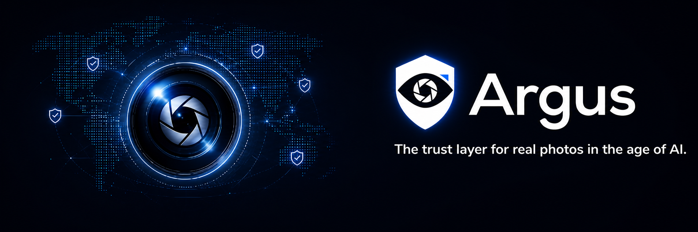
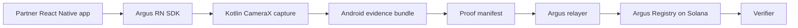

# Argus



Argus is a React Native SDK and Solana registry prototype for verifying that a submitted photo came through an Argus-controlled in-app capture flow.

It is not an AI-image detector and it does not prove that a physical scene is true. Argus verifies a narrower claim: the submitted photo bytes match a capture manifest, Android-side evidence, relayer policy, and an authorized registry commitment.

## How It Works



The verifier checks the whole bundle, not just whether an image hash exists onchain:

```text
photo bytes
canonical manifest
camera evidence JSON
device integrity JSON
relayer session and nonce policy
Argus Registry proof record
```

## Repository Contents

| Path | Purpose |
| --- | --- |
| [`packages/argus-rn-sdk`](./packages/argus-rn-sdk) | React Native SDK, capture entrypoint, proof status helpers, verifier helpers, and UI components |
| [`packages/argus-rn-sdk/android`](./packages/argus-rn-sdk/android) | Kotlin Android native module, CameraX capture flow, app identity, motion, file binding, and Keystore evidence |
| [`crates/argus-core`](./crates/argus-core) | Rust canonical proof core for manifest, hash, proof ID, registry payload, and verifier rules |
| [`api/relayer`](./api/relayer) | Relayer/session/proof validation functions and Solana submitter path |
| [`programs/argus-registry`](./programs/argus-registry) | Anchor program for authorized proof-record registration |
| [`apps/marketplace-demo`](./apps/marketplace-demo) | Reference React Native and browser demo surface |
| [`apps/verifier-web`](./apps/verifier-web) | Reference verifier UI |
| [`scripts`](./scripts) | Local demo, test, and preview helpers |
| [`x_images`](./x_images) | Logo and banner assets |

## Current Status

Implemented:

- RN SDK entrypoint: partner app calls `createCaptureProof`.
- Android CameraX capture path with no gallery picker.
- Native evidence collection for file binding, app signing identity, motion snapshot, and Keystore material.
- Rust proof core with tests for canonical manifest, hash, proof ID, byte policy, and registry payload rules.
- Relayer validation functions for nonce/session/app identity/proof bundle checks.
- Anchor registry program that only accepts `register_proof` from the configured authorized relayer.
- Demo marketplace and verifier screens.

Still prototype:

- The relayer code is function-level; there is no standalone HTTP API server yet.
- Production proof-bundle storage and verifier API are not implemented.
- Android currently mirrors Rust proof rules in Kotlin through `ArgusRustBridge.kt`; JNI/UniFFI binding is the intended hardening path.
- The registry and proof policy currently support the demo use case `marketplace_listing`.
- Local/browser demos use preview data and must not be treated as production verification.

## Trust Model

Argus production status requires all of these to match:

- exact submitted photo bytes
- canonical Argus manifest
- manifest hash and image hash
- committed camera and device evidence
- relayer-issued session nonce
- partner ID, use case, and app identity policy
- active Argus Registry record
- authorized relayer signer and fee-payer binding

Solana stores compact commitments only. Photos and raw evidence stay offchain. The chain does not inspect Android internals; it anchors the commitments accepted by the relayer so later bundle rewrites can be detected.

## Evidence Levels

| Level | Meaning |
| --- | --- |
| Level 1 | Demo or local bundle check only |
| Level 2 | Native Android capture evidence plus full registry/relayer trust root |
| Level 3 | Level 2 plus validated Android Keystore signature binding |
| Level 4 | Level 3 plus Android Key Attestation root validation |

None of these are camera-sensor signatures.

## Setup

Install dependencies:

```bash
npm install
```

Copy local environment placeholders:

```bash
cp .env.example .env
```

Keep `.env`, keypairs, RPC secrets, and production relayer keys out of git.

## Run Checks

```bash
npm test
```

This runs demo verification, relayer security checks, SDK security checks, Rust core tests, Anchor registry tests, syntax checks, and the demo registration script.

Build the Android app:

```bash
npm run android:debug
```

Run the static browser preview:

```bash
npm run demo:web-preview
```

The preview serves:

```text
http://127.0.0.1:4173/apps/marketplace-demo/
http://127.0.0.1:4173/apps/verifier-web/
```

## Modes

| Mode | Notes |
| --- | --- |
| `demo` | Validates local/demo bundle shape and returns non-production records |
| `solana` | Attempts Solana registration through the relayer submitter path |
| production | Requires real Android capture evidence, durable storage, partner auth, authorized relayer, pinned registry configuration, and verifier API |

Default relayer mode is `demo`.

## Important Limits

Argus does not prove ownership, item authenticity, legal validity, user intent, item condition, or that the user did not photograph a screen. It only verifies that the submitted photo followed the Argus capture and registration path.
