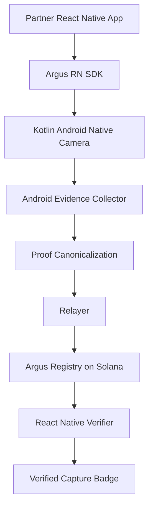

# Argus


**Argus helps platforms verify that user-submitted photo evidence came through a required in-app capture path, instead of guessing whether pixels are AI-generated, reused, or imported.**

Argus is a **B2B Verified Capture SDK and verifier workflow** for platforms that need to enforce a required in-app capture path before a badge, review decision, dispute workflow, claim intake, or field-evidence review depends on a photo. The current reference demo uses used-camera marketplace listings because that workflow is visual and easy to judge, but the root problem is broader: AI-generated, reused, edited, or imported photos being submitted as if they were real in-app captures. Future use cases such as insurance claims, returns, rental/real-estate condition media, and field-work evidence reuse the same capture-provenance layer with their own relayer/verifier policy. When a verifier needs an independent record beyond one platform database, Argus writes compact authorized commitments to the Argus Registry on Solana.

X: [@ArgusSDK](https://x.com/ArgusSDK)  
Brand assets: [`x_images/Argus_logo.png`](./x_images/Argus_logo.png), [`x_images/Argus_banner.png`](./x_images/Argus_banner.png)

## What Argus Does

Product wedge: one required-capture workflow first. Used-camera listings are the current concrete demo of a horizontal capture-provenance layer verified through the full Argus bundle rather than through pixel scoring or a hash-only record.

Argus lets a partner platform embed an Argus-controlled native Android capture flow. A user takes a photo inside the partner app, Argus binds the submitted file to Android device-side evidence, the native proof layer emits a deterministic manifest using the same canonical rules as `crates/argus-core`, and an authorized production relayer fee payer registers the commitments with sponsored gas in the production-pinned Argus Registry on Solana without exposing the user to wallets or gas. In production, the relayer checks the full proof bundle and partner/use-case/app identity policy before sponsorship; it does not accept a naked hash.

Argus is not an AI-image detector. Instead of scoring pixels after upload, it verifies a narrower fact: the submitted photo passed through the Argus-controlled capture flow, evidence binding, and authorized registry path.

Argus verifies **capture-path provenance**, not absolute physical truth. It does not prove item existence, ownership, authenticity, legal validity, item condition, seller intent, or that the photographer did not photograph a screen.

The registry is not a generic "upload any hash" contract. A production record qualifies as Verified Capture only when it ties the required capture and evidence commitments to sponsored registration by an authorized production relayer fee payer under the production-pinned Argus Registry program, trusted registry configuration, and allowlisted partner/use-case/app identity policy.

Current Rust/registry policy allowlists `marketplace_listing` as the demo-supported use case. That is a policy gate, not a product ceiling: additional use cases such as `insurance_claim` or field evidence should be added only with matching relayer/verifier policy, evidence requirements, and UI claim boundaries.

## What Works Now

This repo contains a full reference path for the current Argus proof model:

| Surface | Current state |
| --- | --- |
| React Native SDK | Partner-facing capture/proof API, badge/status components, relayer submission helper, verifier helpers, and conservative failure handling. |
| Android native capture | CameraX capture flow, SDK-owned cache file policy, byte binding, app identity digest, motion evidence, Level 3 Keystore signature material, and Level 4 attestation material capture with relayer-gated trust. |
| Rust proof core | Deterministic manifest construction, image hashing, proof ID generation, registry payload validation, evidence commitment checks, byte caps, and JPEG-like structure policy. |
| Relayer/backend | Capture session nonce issuance, request/body limits, partner/use-case/app identity allowlist policy, proof-bundle validation, Level 3 signature verification, Level 4 attestation-chain/root policy, sponsored registration path, and verifier bundle retrieval shape. |
| Argus Registry | Anchor program that accepts proof commitments only from the configured authorized relayer and currently allowlists the demo `marketplace_listing` use case. |
| Verifier/demo UI | Reference marketplace-shaped demo plus verifier UI that recomputes the bundle, displays capture-provenance status, and labels demo/non-production states conservatively. |

## Production vs Demo Modes

Keep the mode labels simple:

| Mode | What it means | Badge rule |
| --- | --- | --- |
| **Production Verified Capture** | Full production trust root: production Android capture evidence, matching photo/manifest/evidence commitments, required device/app/motion commitments, production-pinned registry/config, authorized production relayer fee payer, sponsored gas/fee-payer binding, and allowlisted partner/use-case/app identity policy. | Only this mode may show the production badge. |
| **Solana/devnet integration demo** | Uses production-style relayer policy such as `ARGUS_PARTNER_APP_ALLOWLIST`, but runs outside the complete production trust root. | Call it integration/demo unless the production Android capture path, required device-side commitments, production-pinned registry program, trusted registry configuration, authorized production relayer fee payer, and sponsored gas/fee-payer binding are all present. |
| **Demo Preview** | Local RN, browser, simulator, `mock://`, `proofLevel: "demo"`, localStorage records keyed by an explicit `proofId`, `demo_verified`, or simulated transaction references. The simulator/demo `android-native-camera-stub` belongs here. | Useful for UX and verifier flow only; do not show the production badge. A browser preview without `proofId` is invalid and must not auto-load a saved demo record. |
| **Non-production record** | `relayerAuthorized: false`, `status: "superseded"`, missing required evidence, or unsupported proof level. | Must not be pitched as production verified capture. |

## Evidence Levels

Use evidence levels as verifier policy labels, not truth scores. The registry `proofLevel` remains `app_capture` for production registry records; Android evidence levels ride inside the committed device evidence and may be displayed only when the verifier path validates the extra evidence.

| Level | Claim boundary |
| --- | --- |
| **Level 1 - Demo / bundle check** | Photo, manifest, and evidence commitments can be recomputed locally or in a preview, but there is no production badge or production registry trust root. |
| **Level 2 - Verified Capture (`app_capture`)** | Current production claim when the full trust root is present: native Android capture evidence, camera freshness, motion snapshot, app identity, nonce/session binding, byte/manifest/evidence commitments, production-pinned registry/config, authorized production relayer fee payer, and sponsored gas all verify. |
| **Level 3 - Keystore-signed binding** | Level 2 plus a verifier-validated Android Keystore signature over the proof manifest/device-binding message and signer public key. This is not a camera sensor signature. |
| **Level 4 - Hardware-backed key attestation** | Level 3 plus Android Key Attestation that validates the signing key against the capture-session nonce, TEE/StrongBox security level, and configured trusted root/fingerprint. If Level 4 is unsupported, unverifiable, no attestation root fingerprint is configured, or root validation fails, fall back to Level 3 or Level 2 and do not claim hardware-backed attestation. |

## First Pilot And Buyer

The initial ICP is the trust, safety, claims, fraud, review, field-operations, listing-integrity, or category owner for one high-value photo-evidence workflow that can require fresh in-app capture. Used-camera listings are the reference demo, not the product boundary. The same buyer pattern exists in insurance or warranty claims, return disputes, rental and real-estate media, transaction evidence, and field verification. Argus is embedded in the partner app as an SDK, not launched as a standalone consumer camera app, and is paid for as verification infrastructure: SDK integration, sponsored registration, verifier API, and later review tooling after Verified Capture volume exists.

The pain is operational, not theoretical: when a photo affects money, access, trust, or dispute resolution, the platform needs a defensible capture rule before it grants a badge, accepts a claim, triggers review, or relies on the photo as evidence.

Why now: generative tools, marketplace photo policies, claims workflows, and broader platform fraud pressure make the capture-path enforcement gap plausible enough to test in a narrow workflow pilot. They are context for the wedge, not evidence that platforms have validated demand.

Available evidence is market-context support, not proof of customer demand; customer validation starts with one required-capture workflow pilot with a platform partner.

The wedge is narrow: for workflows where a platform chooses to require fresh capture, make Argus SDK captures distinguishable from non-capture upload paths such as gallery imports, reused/stock file imports, AI-generated file imports, manipulated evidence, and unverifiable uploads. Verified Capture is useful only when the verifier can check the full Argus bundle, not just an onchain hash.

Platform integration matters because the platform controls the submission moment, workflow rules, badge/status placement, and review path. A standalone camera app cannot force users to use the capture path; an embedded SDK can.

Why this needs to be a company: platforms are not buying a camera screen or another pixel-scoring detector; they need an accountable capture rule across SDK capture, verification policy, relayer operations, registry records, verifier UX, and partner integration. C2PA can complement Argus, but C2PA mainly answers which credential is attached to a file and who signed it; Argus answers whether the platform-required capture path, relayer authorization, and registry policy were satisfied. Internal database flags are also not externally verifiable once an image leaves one platform.

Platform action: issue the Verified Capture badge/status only for a passing Argus bundle, require a fresh Argus retake when the bundle is missing or fails, downgrade the submission to unverified, reject the evidence, or escalate suspicious cases to review. If the status does not change one of these workflows, it is decoration and should not be pitched as the wedge. A buyer, reviewer, adjuster, auditor, or counterparty can treat Verified Capture as stronger capture-path provenance than a gallery upload and open the verifier for high-value cases. The badge should not be treated as proof of ownership, authenticity, item condition, legal validity, or user intent.

Fraud boundary: Argus reduces false Verified Capture claims by denying the production badge to direct file imports such as gallery, reused/stock, or AI-generated files, and to replay/backdating attempts that fail nonce/session/relayer policy. It does not stop ordinary unverified uploads, theft, counterfeit goods, off-frame damage, staged scenes, photographing a screen or printout, compromised clients that bypass integrity policy, collusion, shipping fraud, or false seller claims outside the photo.

Post-hackathon wedge: pilot one high-value photo-evidence workflow, for example used-camera listings, claims intake, returns, or field verification, with required Argus capture, verifier bundle checks, clear status copy, reviewer escalation for failed verification states, and measurement of retake, review, dispute, and fraud signals.

## Architecture



Current implementation note: `crates/argus-core` is the tested Rust proof core and FFI target for deterministic manifest/proof rules. The Android MVP currently emits matching manifest and proof fields through `ArgusRustBridge.kt`, so the bundle schema can stay stable while the bridge is later hardened into JNI/UniFFI.

## Registry Trust Model

The Argus Registry on Solana must distinguish an Argus commitment record from a random hash someone posted onchain.

MVP `register_proof` shape:

```text
register_proof(
  proof_id,
  manifest_hash,
  image_hash,
  partner_id_hash,
  capture_timestamp,
  proof_level,
  use_case,
  schema_version
)
```

The key rule:

```text
Only an Argus-authorized relayer with expected sponsored gas/fee-payer binding can register Argus commitment records that qualify for production Verified Capture.
```

Registry initialization and relayer authorization are part of the trust root. A production registry must be initialized by the Argus program upgrade authority, and verifier/ops tooling should treat registries or relayer lists created by any other authority as untrusted.

The current Anchor surface exposes `initialize_config`, `update_authorized_relayer`, `update_admin`, and `register_proof`. `register_proof` writes a proof-record PDA derived from `proof_id` and fails unless the signer matches `config.authorized_relayer`.

Onchain records should look like protocol records, not loose hashes:

```text
ArgusProofRecord {
  proofId,
  manifestHash,
  imageHash,
  partnerIdHash,
  captureTimestamp,
  proofLevel,
  useCase,
  schemaVersion,
  registeredAt,
  relayer,
  status
}
```

The relayer is the signer/account authority, not a loose instruction-data field. A record is trusted only when that signer is authorized in the expected Argus Registry trust root.

The verifier should also check the known Argus Registry program ID. `programId` is part of the verifier trust root even if it is not stored inside each record.

Verifier links are allowlisted entrypoints only: their base URL must be the production default `https://verify.argus.dev` or an explicitly configured partner base. Raw URL paths, including raw backslash separators that URL parsers normalize, are rejected when they decode into traversal before the verifier base is accepted. That entrypoint does not confer Verified Capture; the verifier still has to check the full Argus bundle and trust root.

## Why Solana

Argus needs a public commitment record only when a verifier must check the result outside one platform database; lead with that verifier need, not chain jargon. If a partner only wants an internal workflow flag, a platform database is enough. The Argus Registry on Solana stores compact public provenance commitments only: manifest hash, image hash, partner/proof metadata, proof level, relayer, and status.

Solana does not certify photo content or Android evidence by itself; it makes the authorized commitment record externally checkable when the verifier cannot rely on platform metadata alone.

Raw photos and sensitive evidence stay offchain. Users do not touch wallets; the authorized production relayer fee payer sponsors registration with policy-bound gas and is part of the trust boundary. A random wallet posting a matching hash is not a Verified Capture record.

## Accountable Trust And Storage

Argus is not a backend-free trustless photo oracle. Production trust is split deliberately:

```text
Argus SDK / native capture -> collects the photo and device-side evidence
Argus backend / relayer -> validates session, nonce, partner policy, app identity, manifest, evidence, and bytes
Argus Registry on Solana -> anchors the accepted commitments so they cannot be silently rewritten later
Verifier -> fetches the bundle and recomputes hashes against the registry record
```

This makes the Argus backend important, but not arbitrary. The backend is the gatekeeper before registration; Solana is the tamper-evidence anchor after registration. If the backend later serves a different photo, manifest, or evidence bundle, the verifier recomputes the hashes and detects that the bundle no longer matches the onchain commitments.

Production storage should be explicit:

| Data | Storage |
| --- | --- |
| Photo bytes / platform image | Platform image/evidence storage or verifier-provided upload |
| `canonicalManifestJson`, `metadataJson`, `cameraEvidenceJson`, `deviceIntegrityJson` | Partner or Argus proof-bundle store keyed by `proofId` |
| `ArgusProofRecord` commitments | Argus Registry on Solana |
| Capture session, nonce, consumed/expired state | Relayer/backend DB with short TTL and one-time consumption |
| Partner/use-case/app identity policy | Relayer config or policy DB |

Current code uses local/demo storage for this shape: browser/local demos keep proof bundles in localStorage, and `api/relayer/sessionStore.mjs` uses an in-memory session map. Production needs durable proof-bundle storage, durable session/audit storage, partner authentication, rate limiting, and relayer key rotation/operations.

The verifier must not rely on the proof-bundle store by itself. It uses the store to retrieve offchain data, then verifies that the photo, manifest, evidence commitments, registry record, authorized relayer fee payer, sponsored gas/fee-payer binding, and trusted registry configuration all match.

Failed or missing verifier API responses must not be displayed as verification evidence. The client should reset match flags and drop verifier-supplied proof objects, transaction references, links, and claim-like messages before rendering failure UI. Missing proof-bundle retrieval should render as missing or pending, while mismatched hashes or commitments should render as mismatch.

Pitch the onchain role strongly but precisely: Solana gives Argus an externally checkable, public, tamper-evident commitment record for accepted proof bundles. Do not pitch Solana as the component that directly proves physical camera truth or replaces relayer policy.

## Android Embedded Evidence

The Android layer is where Argus collects capture evidence. The goal is not to claim that the camera sensor cryptographically signed the pixels. Normal Android apps do not get a universal sensor signature over image bytes. The practical production goal is to bind exact submitted photo bytes to an SDK-controlled native capture flow plus required device-side evidence.

```text
native Android capture flow + committed camera evidence summary + manifest-matching capturedAtMs + detailed motion snapshot near capture + app identity + server nonce + optional integrity status when available
```

| Android signal | How Argus gets it | What Argus verifies |
| --- | --- | --- |
| Native capture path | Kotlin `ArgusCameraActivity` opens CameraX `Preview` and `ImageCapture` instead of a gallery picker | The photo came through an Argus-controlled in-app capture flow |
| Captured file binding | The SDK reserves a cache file, checks expected name/timestamp/path, rejects symlinks, reads under the capture byte cap, then rechecks file identity, timestamp, and length | The submitted file is tied to the SDK capture session instead of being accepted as an arbitrary React Native upload |
| Camera evidence summary | Native capture-surface flags, no-gallery-import flag, lens-facing/file-size summary, and fresh `capturedAtMs`/`collectedAtMs` timing | The submitted file is bound to committed camera-path evidence whose `capturedAtMs` matches the manifest |
| Motion snapshot | `SensorManager` accelerometer and gyroscope samples near shutter time | The capture has a detailed device-motion context instead of being only a static file import |
| App identity | Package name and signing certificate digest | The bundle is tied to the expected partner app identity / SDK integration |
| Server nonce | Relayer or partner backend issues a short-lived nonce before capture | The manifest is fresh and harder to replay or backdate |
| Optional integrity status | Level 3 Keystore signatures and Level 4 Android Key Attestation are carried only when the verifier/relayer validates the manifest/device-binding signature, signing key, nonce challenge, TEE/StrongBox security level, certificate-chain evidence, and configured trusted root/fingerprint; unsupported, unverifiable, or root-unvalidated Level 4 records must fall back to Level 3 or Level 2 | Optional app/device context; not a camera-sensor signature and not required for the core proof |

The verifier should show these as an evidence summary, not as a claim that the scene itself is true.

## Product Flow

1. A platform user taps **Take Verified Capture photo** inside the partner app; the reference demo shows a marketplace seller doing this for a listing.
2. The Argus RN SDK calls the Kotlin Android native camera module.
3. Kotlin captures the photo and commits a camera evidence summary, manifest-matching capture time, detailed motion evidence, app identity, nonce, and optional integrity signals.
4. The proof layer hashes the exact submitted photo bytes, canonicalizes the manifest, and returns `proofId`, `imageHash`, and `manifestHash` using the Rust-core canonical format.
5. The relayer checks capture session, nonce, partner/use-case/app identity allowlist, canonical `photoBytesBase64`, a basic JPEG-like byte-shape policy, the 20 MiB cap, and hash/byte-count/evidence matches before returning a demo record or sponsoring Solana registration.
6. In Solana mode, the Anchor program accepts registration only from an Argus-authorized relayer signer; the production badge also requires sponsored gas/fee-payer binding.
7. The Anchor program stores commitments only, never raw images or sensitive metadata.
8. The React Native verifier recomputes the manifest hash, checks the Argus Registry record, verifies relayer authority plus sponsored gas/fee-payer binding, and explains the proof status and limitations.

## Verification Bundle

The verifier must not ask only:

```text
Is this image hash somewhere onchain?
```

It must verify the whole bundle:

```text
photo bytes / photo.jpg
manifest.json
optional evidence bundle / signatures
on-chain ArgusProofRecord
```

Verifier checklist:

```text
1. Does `photoBytesBase64` use canonical base64 and decode under the 20 MiB cap to bytes that pass the basic JPEG-like byte-shape gate?
2. Does the photo byte hash match `imageHash`, `manifest.image_sha256`, and the registry `imageHash`?
3. Does `cameraEvidence.capturedFileBytes` match the decoded photo byte length?
4. Does the manifest follow the Argus schema?
5. Does the manifestHash match the canonical manifest bytes?
6. Does the Argus Registry contain that manifestHash?
7. Was the registry entry written by an Argus-authorized relayer signer?
8. Does sponsored gas/fee-payer binding match the relayer policy?
9. Does the entry belong to the production-pinned known Argus Registry program ID?
10. Was the registry configuration initialized by the Argus program upgrade authority?
11. Does the manifest include camera evidence, app identity, and any required device integrity commitments?
12. Do nonce, session, app identity, camera `capturedAtMs`, detailed motion snapshot, and optional signatures match the relayer policy?
```

This is the difference between "a hash existed" and "this photo came through the Argus capture path, matched the evidence and manifest commitments, and was registered by an authorized relayer fee payer with sponsored gas."

These byte checks are production gates that bind the exact submitted file to the manifest, evidence, and registry commitments and reject malformed or oversized payloads. They are not a claim of camera origin by bytes alone, deep JPEG/container semantic validation, media forensics, sensor signature, or identical decoding across all image viewers.

## Repository Map

| Path | Purpose |
| --- | --- |
| [`packages/argus-rn-sdk`](./packages/argus-rn-sdk) | Partner-facing React Native SDK surface |
| [`crates/argus-core`](./crates/argus-core) | Rust canonical proof core for hashing, manifest construction, registry payloads, and verification helpers |
| [`programs/argus-registry`](./programs/argus-registry) | Anchor Argus Registry on Solana |
| [`api/relayer`](./api/relayer) | Demo and Solana-mode sponsored registration relayer |
| [`apps/marketplace-demo`](./apps/marketplace-demo) | React Native reference marketplace demo for the capture-provenance flow |
| [`apps/verifier-web`](./apps/verifier-web) | React Native and static browser verifier demo |
| [`x_images`](./x_images) | X profile logo and banner assets |

## Local Setup

This repo has a local `.env` for devnet work. Keep it private.

Expected local variables:

```text
SOLANA_CLUSTER=devnet
SOLANA_RPC_URL=...
ANCHOR_PROVIDER_URL=...
ANCHOR_WALLET=...
SOLANA_KEYPAIR_PATH=...
SOLANA_PUBLIC_KEY=...
ARGUS_RELAYER_KEYPAIR=...
ARGUS_AUTHORIZED_RELAYER_PUBLIC_KEY=...
ARGUS_RELAYER_MODE=demo|solana
ARGUS_REGISTRY_PROGRAM_ID=...
ARGUS_PARTNER_APP_ALLOWLIST=[{"partnerId":"recommerce-demo","useCases":["marketplace_listing"],"appIdentityHashes":["..."]}]
ARGUS_VERIFIER_BASE_URL_ALLOWLIST=["https://verify.argus.dev"]
NODE_ENV=development
```

Local development uses Solana CLI, Anchor CLI, a devnet wallet, and an Alchemy devnet RPC configured in `.env`.

Default relayer mode is `demo`: it validates the full bundle but returns `relayerAuthorized: false`, `status: "superseded"`, and `sponsoredGas: false`. Set `ARGUS_RELAYER_MODE=solana` for devnet/localnet transaction submission; that path requires `ARGUS_PARTNER_APP_ALLOWLIST`, a relayer keypair, a reachable RPC URL, and a configured registry. When `NODE_ENV=production`, the relayer disables the built-in demo partner policy, rejects registry program overrides, and requires the configured authorized relayer public key to match the loaded relayer keypair.

## Run Checks

```bash
npm test
```

This runs the RN/demo artifact verifier, relayer and submitter security checks, SDK verifier/security checks, Rust core tests, Argus Registry program tests, RN entry syntax checks, and the demo registration script.

For the static browser preview:

```bash
npm run demo:web-preview
```

The preview serves the reference demo at `http://127.0.0.1:4173/apps/marketplace-demo/` by default, with the verifier at `http://127.0.0.1:4173/apps/verifier-web/`. The port increments if `4173` is occupied.

## Hackathon Scope

Build all required layers, but keep each layer thin:

```text
RN SDK -> Kotlin CameraX Android capture + evidence -> Rust-core canonical proof rules / Kotlin-compatible bridge -> authorized relayer fee payer -> Argus Registry on Solana -> verifier
```

The core demo may stay focused on marketplace listings because it is easy to understand, but the pitch should frame that as one example of a broader capture-provenance SDK for platform photo-evidence workflows. The submission should lead with the root problem: AI-generated, reused, edited, or imported photos being submitted as if they were real in-app captures.
