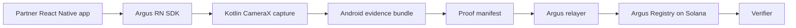

# Argus


Argus is a React Native SDK and Solana registry prototype for verifying that a submitted photo came through an Argus-controlled in-app capture flow.

It is not an AI-image detector and it does not prove that a physical scene is true. Argus verifies a narrower claim: the submitted photo bytes match a capture manifest, Android-side evidence, relayer policy, and an authorized registry commitment.

## How It Works



The verifier checks the whole bundle, not just whether an image hash exists onchain:

```text
photo bytes
canonical manifest
camera evidence JSON
device integrity JSON
relayer session and nonce policy
Argus Registry proof record
```

## Why Solana

Argus uses a Solana program because a platform database flag is not enough once a photo leaves one app. The Argus Registry gives each accepted proof a public, tamper-evident commitment that anyone can inspect later.

The registry is not a generic hash board. It accepts `register_proof` only from the configured Argus-authorized relayer and stores a structured proof record:

```text
proofId
manifestHash
imageHash
partnerIdHash
captureTimestamp
proofLevel
relayer
status
```

That means a verifier is not asking, "does this image hash exist somewhere onchain?" It is asking whether the photo, manifest, evidence commitments, relayer policy, and Argus Registry record all match.

## Android/Kotlin Evidence

The Android native layer is where Argus gets the embedded-device signal. The Kotlin module opens a CameraX capture flow directly; it is not a gallery upload path hidden behind React Native.

The SDK binds the submitted photo to:

- SDK-owned capture file path, file identity, timestamp, byte length, and byte hash
- CameraX capture timing and no-gallery-import evidence
- package name and app signing certificate digest
- relayer-issued capture session ID and nonce
- accelerometer and gyroscope motion snapshot near capture time
- optional Android Keystore signature and key-attestation material

This still is not a camera-sensor signature. The claim is narrower and practical: the submitted bytes came through the Argus-controlled Android capture path and match the committed device evidence.

## Repository Contents

| Path | Purpose |
| --- | --- |
| [`packages/argus-rn-sdk`](./packages/argus-rn-sdk) | React Native SDK, capture entrypoint, proof status helpers, verifier helpers, and UI components |
| [`packages/argus-rn-sdk/android`](./packages/argus-rn-sdk/android) | Kotlin Android native module, CameraX capture flow, app identity, motion, file binding, and Keystore evidence |
| [`crates/argus-core`](./crates/argus-core) | Rust canonical proof core for manifest, hash, proof ID, registry payload, and verifier rules |
| [`api/relayer`](./api/relayer) | Relayer/session/proof validation functions and Solana submitter path |
| [`programs/argus-registry`](./programs/argus-registry) | Anchor program for authorized proof-record registration |
| [`apps/marketplace-demo`](./apps/marketplace-demo) | `ebay_argus` React Native app and browser preview for marketplace capture, listing, product, and proof-status demo flows |
| [`scripts`](./scripts) | Local demo, test, and preview helpers |
| [`x_images`](./x_images) | Logo and banner assets |

## Current Status

Implemented:

- RN SDK entrypoint: partner app calls `createCaptureProof`.
- Android CameraX capture path with no gallery picker.
- Native evidence collection for file binding, app signing identity, motion snapshot, and Keystore material.
- Rust proof core with tests for canonical manifest, hash, proof ID, byte policy, and registry payload rules.
- Relayer validation functions for nonce/session/app identity/proof bundle checks.
- Anchor registry program that only accepts `register_proof` from the configured authorized relayer.
- `ebay_argus` marketplace demo screens for capture, local listing preview, product detail proof status, and backend-assisted verification.

Still prototype:

- The relayer has a minimal HTTP server for demo use.
- Proof-bundle storage is file-based demo storage; production storage is not implemented.
- Android currently mirrors Rust proof rules in Kotlin through `ArgusRustBridge.kt`; JNI/UniFFI binding is the intended hardening path.
- The registry and proof policy currently support the demo use case `marketplace_listing`.
- Local/browser demos use preview data and must not be treated as production verification.

## Trust Model

Argus production status requires all of these to match:

- exact submitted photo bytes
- canonical Argus manifest
- manifest hash and image hash
- committed camera and device evidence
- relayer-issued session nonce
- partner ID, use case, and app identity policy
- active Argus Registry record
- authorized relayer signer and fee-payer binding

Solana stores compact commitments only. Photos and raw evidence stay offchain. The chain does not inspect Android internals; it anchors the commitments accepted by the relayer so later bundle rewrites can be detected.

## Marketplace Verification Demo Flow

The marketplace demo can show a simple backend-assisted verification flow inside the listing and product-detail surfaces:

```text
ebay_argus app -> Argus backend -> stored proof bundle + Solana devnet lookup
```

In this flow, the backend returns the stored proof bundle, recomputed match flags, the Solana transaction signature, and the proof-record account address. The frontend displays the result and links to public Solana inspection pages:

```text
https://explorer.solana.com/tx/{signature}?cluster=devnet
https://explorer.solana.com/address/{proofRecordPda}?cluster=devnet
```

This is not a fully trustless client-side verifier. The demo backend is the retrieval and recomputation layer; the trust-critical commitment remains the Argus Registry record on Solana, while the marketplace app displays the user-facing capture and verification state.

## Evidence Levels

| Level | Meaning |
| --- | --- |
| Level 1 | Demo or local bundle check only |
| Level 2 | Native Android capture evidence plus full registry/relayer trust root |
| Level 3 | Level 2 plus validated Android Keystore signature binding |
| Level 4 | Level 3 plus Android Key Attestation root validation |

None of these are camera-sensor signatures.

## Setup

Install dependencies:

```bash
npm install
```

Copy local environment placeholders:

```bash
cp .env.example .env
```

Keep `.env`, keypairs, RPC secrets, and production relayer keys out of git.

## Run Checks

```bash
npm test
```

This runs demo verification, relayer security checks, SDK security checks, Rust core tests, Anchor registry tests, syntax checks, and the demo registration script.

Build the Android app:

```bash
npm run android:debug
```

Run the static browser preview:

```bash
npm run demo:web-preview
```

The preview serves:

```text
http://127.0.0.1:4173/apps/marketplace-demo/
```

## Remote Demo Backend

The demo backend can run on a Hyonix Windows server through WSL with Node 20:

```bash
nvm use 20
node -v
npm -v
```

Expected demo runtime:

```text
Node v20.20.x
npm 10.x
```

Run the relayer and Cloudflare tunnel in two tmux sessions:

```bash
tmux new -s argus-backend
cd ~/ARGUS
nvm use 20
export ARGUS_VERIFIER_BASE_URL_ALLOWLIST='["https://<quick-tunnel>.trycloudflare.com"]'
PORT=8787 npm run relayer:server
```

Detach with `Ctrl+b`, then `d`.

```bash
tmux new -s argus-tunnel
cloudflared tunnel --url http://localhost:8787
```

Check the public URL from another machine:

```bash
curl https://<quick-tunnel>.trycloudflare.com/health
curl -X POST https://<quick-tunnel>.trycloudflare.com/capture-session \
  -H 'content-type: application/json' \
  --data '{"partnerId":"recommerce-demo","useCase":"marketplace_listing","appIdentityHash":"c5f00555103b31cc35ccbd6119db30b93d1a8244302361acca205c01ff7d247e"}'
```

The React Native demo reads the current backend URL from [`apps/shared/argusDemoConfig.ts`](./apps/shared/argusDemoConfig.ts). Quick Tunnel URLs change when the tunnel restarts, so update that file before rebuilding the Android demo.

App connection checklist:

```text
1. Tunnel URL works at /health.
2. The same URL is in ARGUS_VERIFIER_BASE_URL_ALLOWLIST.
3. The same URL is in apps/shared/argusDemoConfig.ts.
4. Rebuild the Android demo so the JS bundle has the new URL.
5. Shoot with the in-app CameraX flow and check that /register-proof stores the proof bundle.
```

In demo relayer mode, the app may complete registration, but the returned record stays non-production: `status: "superseded"`, `relayerAuthorized: false`, and `sponsoredGas: false`. Production status requires the Solana relayer mode, an active registry record, the authorized relayer signer, and sponsored gas.

## Devnet Registry Deployment

The devnet deployment helper uses the ignored relayer/admin keypair at `.argus-devnet-keypair.json`. It generates an ignored registry program keypair at `.argus-registry-program-keypair.json`, copies it to Anchor's `target/deploy` path, syncs the public program ID into Anchor/Rust/SDK/relayer constants, and updates local `.env`.

Current devnet IDs after `npm run devnet:prepare`:

```text
Argus Registry Program: STmkbEWTmfBJR2mDHrbvKNjo2spT6mPU9668mw2hMaL
Authorized Relayer: Ao3Vi2HeQHWyyPDA52rqVLYv8nt7pvAVQtPB1qw2pvTs
```

Deploy and initialize on devnet:

```bash
npm run devnet:prepare
npm run devnet:deploy:init
```

If the program is already deployed and only the config PDA needs initialization or relayer rotation:

```bash
npm run devnet:init
```

The deploy command requires both `anchor` and `solana` CLIs on `PATH`. `devnet:deploy:init` is idempotent for the registry config: it initializes config when missing, does nothing when the authorized relayer already matches, and calls `update_authorized_relayer` when the config admin is the devnet keypair but the relayer differs.

## Important Limits

Argus does not prove ownership, item authenticity, legal validity, user intent, item condition, or that the user did not photograph a screen. It only verifies that the submitted photo followed the Argus capture and registration path.
