# Argus Architecture

Argus is a B2B capture-provenance SDK and verifier workflow, not a standalone camera app.

**One-liner:** Argus helps platforms verify device-bound native capture evidence before showing a Verified Capture badge, instead of guessing whether uploaded pixels are AI-generated, reused, or manipulated.

Production verification means a submitted photo came through an Argus-controlled native Android capture flow, was bound to device-side evidence, and was registered by an authorized production relayer fee payer with sponsored gas under the production-pinned known Argus Registry program ID, trusted registry configuration, and allowlisted partner ID, use case, and app identity hash.

`marketplace_listing` is the current reference demo/use case because listing photos are visual and easy to judge. It should be treated as an example policy on top of the general native capture evidence flow, not as the boundary of the Android capture architecture.

```text
Partner app listing workflow
  -> Argus RN SDK
  -> Kotlin Android native capture
  -> Kotlin proof bridge / Rust core rules
  -> Argus-authorized sponsored relayer
  -> Argus Registry on Solana
  -> verifier
```

## One-Slide Architecture Picture

Use this as the single diagram for the technical overview deck and video. The key reading order is left-to-right across trust boundaries: frontend, Android native module, proof rules, backend/relayer/storage, Solana on-chain commitments, then verifier/platform action.

```mermaid
flowchart LR
  subgraph FE[Frontend / partner product]
    A0[Listing details + required capture policy]
    A[Partner React Native App]
    B[Argus RN SDK]
    A0 --> A --> B
  end

  subgraph AN[Android Native module]
    C[CameraX capture]
    C1[Cache path, file identity, byte checks]
    C2[Motion, app identity, nonce]
    C3[Keystore signature / attestation material]
    C --> C1 --> C2 --> C3
  end

  subgraph PR[Proof rules]
    D[Kotlin proof bridge / Rust core rules]
    J[Exact photo hash, manifest hash, proof ID]
    D --> J
  end

  subgraph BE[Backend / relayer / storage]
    E[Authorized relayer policy gate]
    P[Proof bundle store]
    V[Verifier API]
    E --> P --> V
  end

  subgraph OC[On-chain / Solana]
    F[Argus Registry commitments only]
  end

  subgraph ACT[Verification / platform action]
    G[Verifier recomputation]
    H[Badge, retake, downgrade, reject, or review]
    G --> H
  end

  B --> C
  C3 --> D
  J --> E
  E --> F
  F --> G
  P --> G
```



Pitch rule for this diagram: the relayer is the pre-registration gatekeeper; Solana is the external commitment layer; the verifier recomputes the bundle and explains limits before the platform grants status.

## Why Solana Fits Argus

Solana is not the Android evidence verifier. It is the public commitment rail after Argus validation.

Argus's on-chain action is intentionally small: register hashes, status, proof level, use case, relayer identity, and related commitment fields. Photos, listing drafts, and raw evidence stay off-chain. That shape fits Solana better than a storage-heavy chain design because the system needs frequent, externally checkable proof records rather than expensive media storage.

The important Solana-specific points for the pitch:

| Solana property | Why it matters for Argus |
| --- | --- |
| Low-cost compact transactions | Solana's fee structure charges a base fee per signature and optional priority fee, so compact proof records are economically aligned with per-capture evidence events. |
| Sponsored fee payer | Solana transactions have a fee payer, and fee sponsorship is an explicit pattern. Argus can keep the relayer as fee payer so sellers, claimants, or inspectors do not need wallets or SOL. |
| Public commitment record | A buyer, reviewer, auditor, or downstream platform can verify against a record outside the original platform's mutable database. |
| Priority-fee control | Compute-budget and priority-fee controls let the relayer tune cost and scheduling for operational workflows without changing the trust boundary. |

Sources for the above pitch framing: Solana fee structure, base fee, and priority fee are documented at https://solana.com/docs/core/fees/fee-structure; transaction fee-payer requirements are documented at https://solana.com/docs/core/transactions/transaction-structure; sponsored fee-payer abstraction is documented at https://solana.com/docs/payments/send-payments/payment-processing/fee-abstraction.

## Physical Camera Boundary

Normal Android apps do not get a universal cryptographic signature from the physical camera sensor over the image pixels.

For Argus, the strongest practical MVP signal is:

```text
native Android capture flow + committed camera evidence summary + manifest-matching capturedAtMs/freshness timing + detailed accelerometer/gyroscope motion snapshot near capture + app signing digest + server nonce + Level 3 Keystore signature / Level 4 Android Key Attestation only when verifier/relayer policy validates signature, signer/leaf public-key binding, extension-bound session nonce, TEE/StrongBox security level, certificate-chain evidence, and configured trusted root/fingerprint
```

That means Argus binds the photo to an SDK-controlled native capture flow and device-side evidence. It should not claim that the physical camera sensor itself signed the image unless OEM/TEE/camera HAL support is explicitly implemented.

The Android `app_capture` tier must fail production policy when required native camera evidence summary, camera freshness timing, accelerometer/gyroscope motion timing, or the app signing digest is unavailable. Rooted devices, emulators, and mock-camera environments remain explicit limitations unless validated Level 3/4 evidence or other stronger attestation policy is enabled.

Current Android evidence commits a camera evidence summary rather than full Camera2 capture-result fields; ISO, exposure, focal length, and similar fields are future hardening.

## Android Native Evidence Levels

Evidence levels describe verifier policy, not physical truth. The registry `proofLevel` remains `app_capture` for production registry records; Android evidence levels ride inside committed device evidence and are accepted or downgraded by relayer/verifier policy:

| Level | What the system verifies | Claim boundary |
| --- | --- |
| **Level 1 - Demo / bundle check** | Local/browser/simulator or other preview recomputes photo, manifest, and evidence commitments. | No production badge, no production registry trust root, no native Android assurance required. |
| **Level 2 - Native `app_capture`** | Android CameraX path with no gallery import, SDK-owned cache file, path/file-identity/timestamp/symlink/length checks before and after read, byte cap, manifest-matching capture time, app signing digest, motion snapshot, session nonce, exact byte/manifest/evidence commitments, production-pinned registry/config, authorized relayer fee payer, and sponsored gas binding. | Verifies controlled capture-path evidence. It does not prove scene truth, ownership, item authenticity, or camera-sensor-signed pixels. |
| **Level 3 - Keystore-signed binding** | Level 2 plus Android Keystore signature over the canonical proof binding: partner ID, use case, metadata commitment, camera evidence commitment, app identity hash, capture session ID, session nonce, capture time, and image hash. Verifier validates signature, public key material, binding format, and binding hash. | Adds app/device key binding to the proof. It is still not a physical camera signature. |
| **Level 4 - Hardware-backed key attestation** | Level 3 plus Android Key Attestation material: certificate chain, leaf public-key binding, extension-bound session nonce challenge, TEE or StrongBox signal, and configured trusted attestation root/fingerprint validation. | Counts only after relayer/verifier trusted-root validation. Unsupported, unverifiable, unconfigured-root, or root-unvalidated material falls back to Level 3 or Level 2. |

Levels 3 and 4 are app/device key evidence. They are not camera sensor signatures and do not prove scene truth.

## Layer Boundaries

| Layer | Responsibility |
| --- | --- |
| React Native SDK | Partner-facing API, capture component, badge, verifier helper |
| Kotlin Android | Native camera flow, no gallery import, SDK-owned cache capture file policy, bounded native-capture file read with path/file-identity/timestamp/symlink checks and post-read length stability, shared JSON text caps before proof generation, camera evidence summary/freshness timing, manifest-matching capture time, motion/app evidence |
| Proof builder / Rust core | SHA-256 image hash, manifest construction, JSON text caps, manifest hash, proof ID, and registry-payload boundary rechecks for the 4 KiB canonical manifest JSON and 4 KiB capture session ID caps plus zero optional metadata commitments; current Android proof generation mirrors the Rust core canonical rules |
| Relayer | Validate capture session ID + nonce + partner/use case/app identity tuple, canonical lowercase non-zero 64-hex request proof/hash IDs, schema, proof level, shared JSON text caps, canonical `photoBytesBase64`, 20 MiB native-capture photo byte cap, basic JPEG-like native-capture structure, `imageHash`/`manifest.image_sha256` binding, `capturedFileBytes`, and evidence commitments; sponsor registration after policy validation and bind sponsored gas/fee-payer fields to relayer policy |
| Proof bundle store | Store or serve the offchain proof bundle keyed by `proofId`: manifest JSON, metadata JSON, camera evidence JSON, device integrity JSON, proof status, and references to platform photo or evidence storage |
| Argus Registry on Solana | Store Argus commitment records from trusted configured relayers only; never raw images or raw sensitive metadata |
| React Native verifier | Reapply the native-capture byte cap and basic production JPEG-like structure gate, hash submitted photo bytes against `imageHash` and `manifest.image_sha256`, confirm `capturedFileBytes` matches decoded base64 byte length, compare evidence commitments, recompute manifest/proof commitments, check the production-pinned known registry program ID, trusted registry configuration, authorized production relayer fee payer, sponsored gas/fee-payer binding, proof status, and limitations |

## Accountable Trust Model

Argus is not a trustless oracle for photo truth. It is an accountable capture-path verification system with explicit trust boundaries:

```text
SDK/native capture -> collects evidence
backend/relayer -> validates policy and decides whether to register
proof bundle store -> serves offchain data needed for verification
Argus Registry on Solana -> anchors accepted commitments
verifier -> recomputes everything against the registry record
```

The backend and authorized relayer are critical because Solana cannot inspect Android internals, camera surfaces, motion sensors, or raw photo bytes. That is acceptable only if the pitch is honest: the backend is the pre-registration gatekeeper, and Solana is the post-registration tamper-evidence layer. A malicious or compromised relayer can create bad records until detected and rotated, so production needs key protection, allowlist controls, audit logs, revocation/supersession, and monitoring.

Onchain still matters because it prevents silent history rewriting. If the proof bundle store later serves a changed photo, changed manifest, or changed evidence JSON, the verifier hashes those bytes again and fails when they no longer match the registry commitments.

Production storage split:

```text
photo bytes -> platform image or evidence storage or verifier upload
manifest/evidence bundle -> partner or Argus proof-bundle store keyed by proofId
session/nonce consumed state -> relayer/backend DB with short TTL
partner/use-case/app identity policy -> relayer policy config or DB
commitments -> Argus Registry on Solana
```

Current hackathon code uses file-backed demo proof-bundle storage under `.argus-relayer-data/proofs` for the HTTP relayer, browser `localStorage` for the static preview, and an in-memory relayer session map. Production should replace those with durable proof-bundle storage, durable nonce/session/audit storage, partner authentication and rate limiting, and relayer key rotation/operations.

Pitch rule: emphasize Solana as the public commitment layer for accepted Argus verifier bundles. Do not claim Solana directly proves camera origin, scene truth, or Android evidence authenticity.

## Open-Core And Commercial Boundary

Argus can expose enough code and protocol surface for developers and judges to inspect the system:

```text
RN SDK surface
Android native capture reference path
manifest schema and canonicalization rules
Rust proof core
Argus Registry program
verifier bundle checks
demo relayer shape
```

That does not mean anyone can mint production Argus status. Production acceptance is controlled by server-side and operational trust roots:

```text
Argus-authorized hosted relayer access
partner/use-case/app identity allowlist policy
production verifier hosting and proof-bundle retrieval
authorized relayer fee-payer key custody
audit logs, rate limits, abuse monitoring, key rotation, SLA/support
enterprise dedicated relayer/verifier deployments when explicitly authorized
```

A forked SDK or self-hosted relayer may create compatible-looking bundles, but the verifier must reject production status unless the bundle matches the production-pinned known registry program ID, trusted registry configuration, authorized production relayer fee payer, sponsored gas/fee-payer binding, and allowlisted partner policy.

## Registry Is Not A Generic Hash Store

Argus Registry must not accept arbitrary user-submitted hashes as verified captures. Production verification should trust only `ArgusProofRecord` accounts created by an authorized production relayer fee payer with sponsored gas under trusted registry configuration.

```text
ArgusProofRecord {
  proofId,
  manifestHash,
  imageHash,
  partnerIdHash,
  captureTimestamp,
  proofLevel,
  useCase,
  schemaVersion,
  registeredAt,
  relayer,
  status
}
```

The expected `register_proof` inputs are:

```text
proof_id
manifest_hash
image_hash
partner_id_hash
capture_timestamp
proof_level
use_case
schema_version
```

The relayer is the signer/account authority, not an instruction data field. The onchain program does not decide whether Android camera evidence is real or inspect raw photo bytes. It enforces the registry boundary: only trusted configured relayers can create Argus commitment records, and records store commitments that the relayer and verifier compare without trusting platform databases, uploaded file metadata, or an allowlisted verifier entrypoint alone.

Registry configuration is also part of the trust root. Production initialization and relayer authorization should be controlled by the Argus program upgrade authority; a registry or relayer list initialized by another authority must not be treated as production Argus. Production verifier/ops tooling must use the production-pinned known Argus Registry program ID rather than accept an arbitrary program configured at runtime.

## Verifier Bundle

The verifier validates a bundle, not a single hash:

```text
photo bytes + canonical Argus manifest + evidence commitments/signatures + Argus Registry record
```

Verifier checks:

```text
- canonical `photoBytesBase64` decodes to submitted photo bytes under the 20 MiB native-capture photo byte cap; those bytes pass the basic production JPEG-like structure gate when required, hash to `imageHash` and `manifest.image_sha256`, and have a decoded base64 byte length matching `capturedFileBytes`
- manifest follows the supported Argus schema
- canonical manifest bytes hash to manifestHash
- manifestHash exists in the production-pinned known Argus Registry program ID
- registry configuration was initialized by the Argus program upgrade authority
- registry record is active and was created by an authorized production relayer fee payer
- sponsored gas/fee-payer fields bind to the authorized relayer policy
- proofLevel is the supported production `app_capture` level and status is acceptable for the use case
- camera/device evidence commitments, capture session ID + nonce + partner/use case/app identity fields, and optional signature commitments are consistent within the proof bundle
```

The verifier must reject partial evidence. A matching photo hash alone, a matching manifest alone, or a random onchain commitment is not enough.

Verifier links are allowlisted entrypoints, not trust roots. Production verification still depends on the production-pinned known Argus Registry program ID, trusted registry configuration, active record, authorized production relayer fee payer, sponsored gas/fee-payer binding, matching proof bundle, and allowlisted partner ID, use case, and app identity hash.

The verifier bundle binds exact submitted image bytes and decoded base64 byte count, and repeats the basic production JPEG-like structure gate where applicable. It does not claim deep JPEG/container semantic validation or identical decoding across all image viewers.

Proof level is an evidence label for policy decisions. It is not a claim that the scene is true, the listed item exists, the seller owns it, the item is authentic, its condition is accurate, or seller intent is honest.

## Local Demo Mode

The React Native reference evidence app and relayer-backed verifier API are the primary demo artifacts. The current app path is `apps/marketplace-demo/` because that is the visual case study, and the static browser preview is served by `npm run demo:web-preview` at `http://127.0.0.1:4173/apps/marketplace-demo/` by default; the port increments if 4173 is occupied. There is no separate `apps/verifier-web` app in the current codebase.

The current React Native flow is an eBay-style reference marketplace demo: the seller enters title, price, condition, and location, then uses Argus native capture. The app stores multiple local listing drafts under `ebay_argus.local_listings`, keeps the listing draft and proof together, and can recover a local photo data URI from proof bytes for preview. Devnet registration and local fallback states must stay below production Verified Capture. Listing details are workflow context; they are not a substitute for the production trust root.

Relayer-issued verifier links are allowlisted entrypoints that use `<verifierBaseUrl>/proof/{proofId}` with no query or hash and require a verifier route that serves that path; relayer policy caps `verifierBaseUrl` at 2 KiB and rejects traversal after raw slash and backslash-normalized path checks. Verifier/client proof IDs and relayer request proof/hash IDs are canonical lowercase non-zero 64-hex strings. RN verifier API calls use `<verifierBaseUrl>/api/proofs/{proofId}` under the same trusted base. The current relayer also exposes `GET /api/proofs/:proofId/photo` and `GET /api/registrations/:proofId/progress`. The static browser preview is only the app shell for local UX review; its local demo proof links are `argus://verify/local-simulator/{proofId}` deep links backed by localStorage records such as `argus-proof:{proofId}` and `ebay_argus.local_listing`, not production verifier routes.

Demo records may use local simulated evidence when native Android or devnet services are unavailable. `proofLevel: "demo"`, `mock://` relayer responses, localStorage demo records, `demo_verified` results, `relayerAuthorized: false`, `status: "superseded"`, and simulated transaction references are not production verified capture. Demo UI must label that mode and must not imply that Solana or the browser inspected physical camera truth.

Solana/devnet runs are integration demos unless the real Android capture path, required evidence commitments, production-pinned known registry program ID, trusted registry configuration, authorized production relayer fee payer, sponsored gas, and explicitly allowlisted partner ID, use case, and app identity hash are all present.
